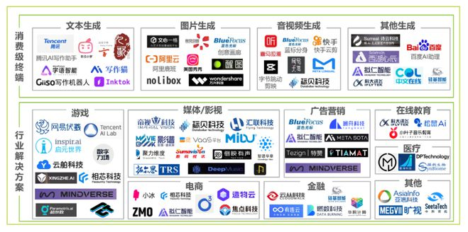

# Hello-AIGC

-----------------------------------------

##  Introduction
Hello-AIGC is a comprehensive resource for the latest news, trends, and insights in the field of artificial intelligence-generated content (AIGC). We provide daily updates on the latest advancements in AIGC technology, including the latest applications, industry news, and emerging trends. Our goal is to keep you up-to-date on the latest trends in the field and help you stay ahead of the competition. Whether you're a business leader, investor, or just interested in learning more about AIGC, we've got you covered.

[comment]: <> ([![Link to a GIF picture]&#40;source/index1.gif&#41;]&#40;&#41;)

[comment]: <> (
)

[comment]: <> (  )

[comment]: <> (
)

## Quick Start

To view the content, please scan the QR code below and ask the robot. This is a GPT question-and-answer robot in the vertical field of AIGC. We will also open API interfaces at a later time.

## Large language model operation platform

This is also a solution to the practical implementation of large language models, which constructs a multi-level governance model to handle various possible results provided by the Q&A model, providing users with extraordinary and real large-scale promotion of large language model effects

[comment]: <> (## 目录)

[comment]: <> (| 周一 | 周二 | 周三 | 周四 | 周五 |)

[comment]: <> (| ------- | ----- | ------------ | ------ | --------- |)

[comment]: <> (| [第20230626期]&#40;content/HelloAIGC-20230626.md&#41; | [第20230627期]&#40;content/HelloAIGC-20230627.md&#41; | [第20230628期]&#40;content/HelloAIGC-20230628.md&#41; |  |   |)

[comment]: <> (| [第20230619期]&#40;content/HelloAIGC-20230619.md&#41; | [第20230620期]&#40;content/HelloAIGC-20230620.md&#41; | [第20230621期]&#40;content/HelloAIGC-20230621.md&#41; | 端午 |  [第20230625期]&#40;content/HelloAIGC-20230625.md&#41; |)

[comment]: <> (| [第20230612期]&#40;content/HelloAIGC-20230612.md&#41; | [第20230613期]&#40;content/HelloAIGC-20230613.md&#41; | [第20230614期]&#40;content/HelloAIGC-20230614.md&#41; | [第20230615期]&#40;content/HelloAIGC-20230615.md&#41; | [第20230616期]&#40;content/HelloAIGC-20230616.md&#41; |)

[comment]: <> (| [第20230605期]&#40;content/HelloAIGC-20230605.md&#41; | [第20230606期]&#40;content/HelloAIGC-20230606.md&#41; | [第20230607期]&#40;content/HelloAIGC-20230607.md&#41; | [第20230608期]&#40;content/HelloAIGC-20230608.md&#41; | [第20230609期]&#40;content/HelloAIGC-20230609.md&#41; |)

[comment]: <> (| [第20230529期]&#40;content/HelloAIGC-20230529.md&#41; | [第20230530期]&#40;content/HelloAIGC-20230530.md&#41; | [第20230531期]&#40;content/HelloAIGC-20230531.md&#41; | [第20230601期]&#40;content/HelloAIGC-20230601.md&#41; | [第20230602期]&#40;content/HelloAIGC-20230602.md&#41; |)

[comment]: <> (| |  |  |  |  [第20230526期]&#40;content/HelloAIGC-20230526.md&#41; |)

[comment]: <> (
)

[comment]: <> (  )

[comment]: <> (
)